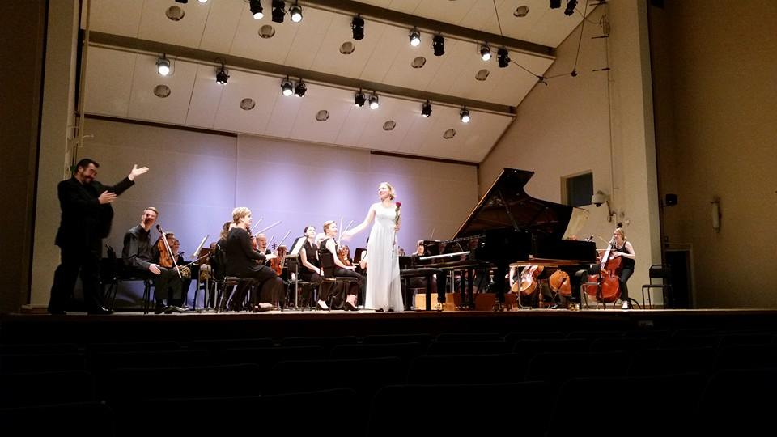

<!---->

</a>

<!--

in progress
 
 
 
 
 
 
 

   

   

   

   

   

  

  

   

   
  

  

  

  

   

  	
  

  

  

   

   
  

 

  

   

   
  

 

 

  

   

   
  

 

-->

<!--

  

   
  

  

  	
  

  
  
  

-->
